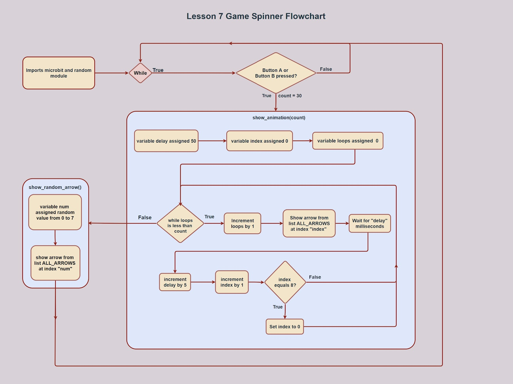

# Microbit_Game_Spinner
Lesson 8 of my Intro to Python course with Microbit

Overview: This program is a spinning game, similar to a popular game in real life where people spin a bottle and it points in a random direction. The micro bit display randomly animates and spins an arrow that points in a random direction whenever either Button A or Button B is pressed. 

Learnings: Some new things I learned in this lesson were regarding functions and how they work. I learned the syntax to define a function, which is def followed by the function name along with any parameters. I also learned that the parameters of a function are used as inputs for the function, the function usually references these parameters and does whatever it was programmed to do with them. Functions are a very important and useful part of python because of the sheer versatility they provide and their reusability. You won’t have to repeatedly write the code, you can just call the function whenever it is necessary and it will be much more efficient, both to program and to debug. Another new thing I learned was how the logic operators work in python, there are three main operators, “and”, “or”, and “not”. In this program specifically, I used it in “if” statements. 

Applications: By looking at the spin_animation(count) function, I could think of some real-world connections. This function basically animates the spinning of the arrow to make it look more realistic, it does this by repeatedly and quickly showing different images of the arrows to give us an illusion of a spinning arrow, then incrementing the delay between the images is used to simulate natural slowing down of the arrow due to friction. This is similar to how most things are animated in many modern video games, thousands of images are quickly shown which give the illusion of movement. This is actually what the framerate of videos measures, the number of pictures shown per second. In fact, videos are just a bunch of images that are switched at a particular rate to make the motion appear to the naked eye. This same method of animations can be used to make a video on the microbit. 

Connections: A connection I made to the previous lessons was with the while loop, not the infinitely looping one, but the other one in the spin_animation() function. Overall, this lesson expanded my horizons on what is possible with a while loop, conditional statements, and logic operators on how they can be utilized in python. 

